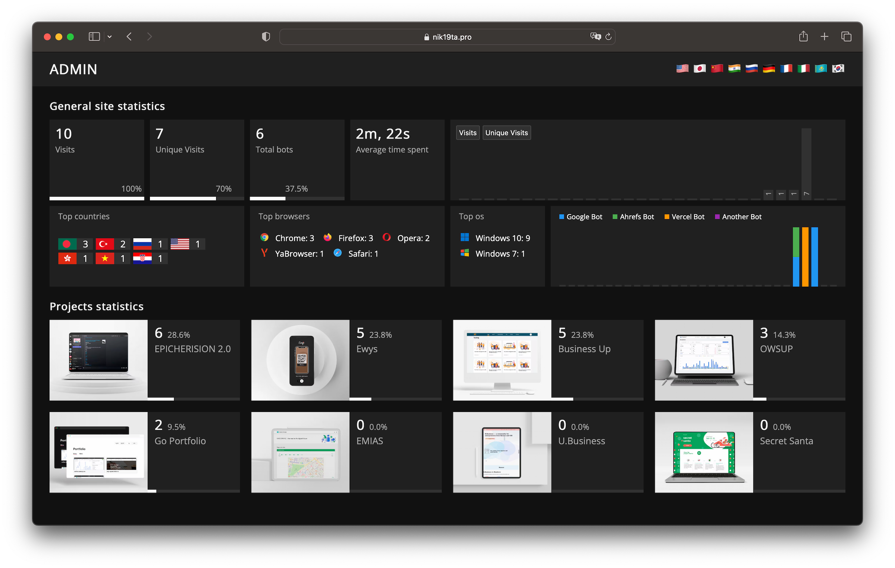
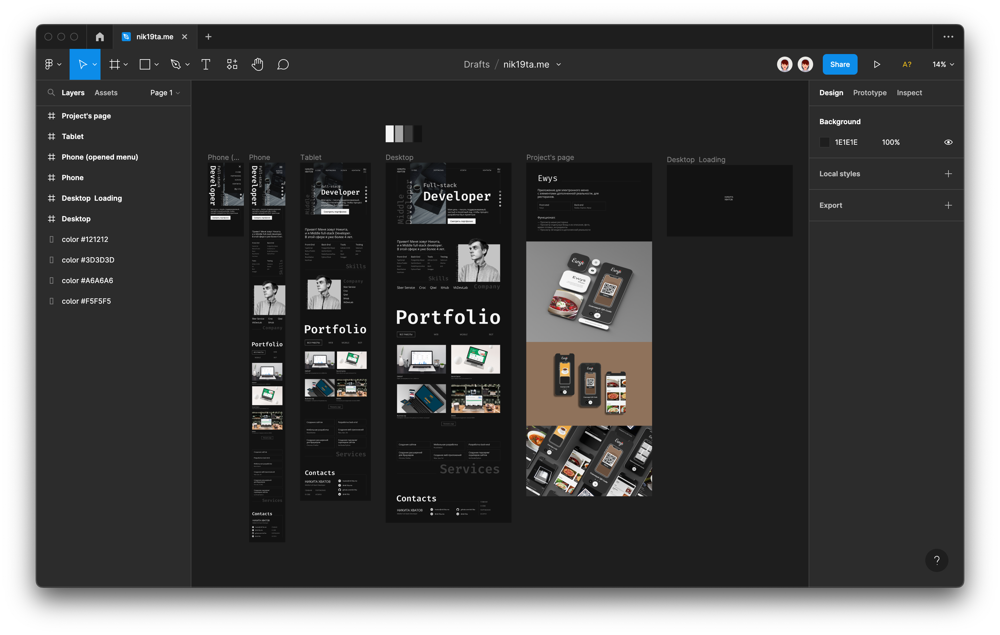
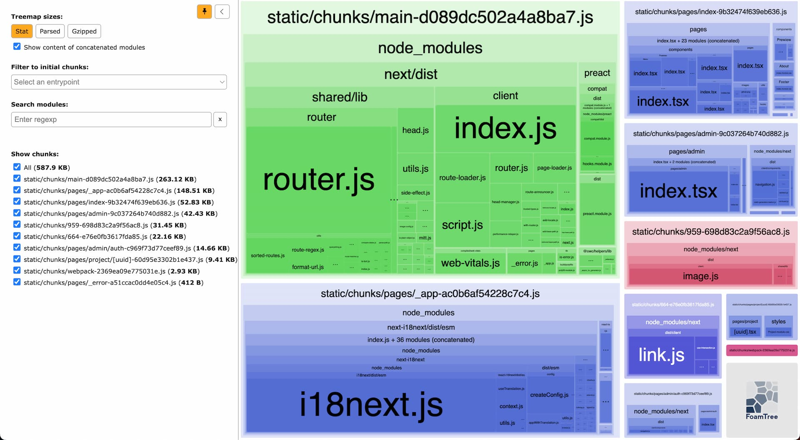

# nik19ta.pro

## About the project

Welcome to my personal website! This website was built using React, React-Router and Golang (Gin, Gorm). It's a platform where I can showcase my work, skills, and projects to the world. 

### Tools

This website uses the following tools and technologies:

- Lang - `TypeScript` (front-end) / `Golang` (back-end)
- Framework (front-end) - `NextJs`
- Framework (back-end) - `Gin`
- DataBase - `PostgreSQL`
- ORM - `GORM`
- For multilingual - `i18n`
- For CI/CD - `GitHub Actions (self-hosted ubuntu)`
- Code analysis - `eslint`
- Reverse Proxy / ssl - `Nginx & brotli`
- Docs - Swagger `swag`

### Self-written admin panel on golang with functionality:
- View visits (by day and total for the month)
- View unique visits (by day and total for the month)
- See which projects are visited the most
- View statistics by country
- Browsing browsers
- View operating systems
- Showing which bots visit the site
- Viewing link click statistics
- (will be soon) Editing projects



### Links

- Visit [nik19ta.pro](https://nik19ta.pro) to see the live website
- View the figma for the website layout and design [](https://www.figma.com/file/NKcx7nhqQJoVLYecFC9USK/nik19ta.me)
- View [swagger](https://nik19ta.pro/swagger/index.html)


### `Preact` instead of `ReactJS` (Why?)

> I used the webpack-bundle-analyzer package to understand how much the bundle weighs after compilation with `react` and with `preact`

| Treemap sizes | React | Preact |
| --- | --- | --- |
| `Stat` | 706.54 KB | 587.9 KB (`-20.17%`) |
| `Parsed` | 466.78 KB | 354.47 KB (`-24.06%`) |
| `Gzipped` | 126.05 KB | 90.26 KB (`-28.4%`) |

| React | Preact |
| --- | --- |
|  |  |

## How to run

### Local development

To start developing the website locally, follow these steps:

- front: `yarn dev`
- back `make dev`

### Setting up Nginx on a server

If you want to host the website on a server using Nginx and SSL, follow these steps:

- Create a new Nginx configuration file using the file at [nginx/sites-available/nik19ta.pro.conf](./backend/nginx/sites-available/nik19ta.pro.conf) as a template.
- Install and configure Nginx and SSL on your server using [these instructions](https://github.com/pepelsbey/playground/tree/main/56).

### backend

To create the necessary database for the backend, run the following SQL query:

```sql
CREATE DATABASE nik19ta;
```

A database dump is also included in the `./backend/dump/dump.sql` file.

Thank you for your interest in my website! If you have any questions or feedback, please feel free to contact me. star me!
